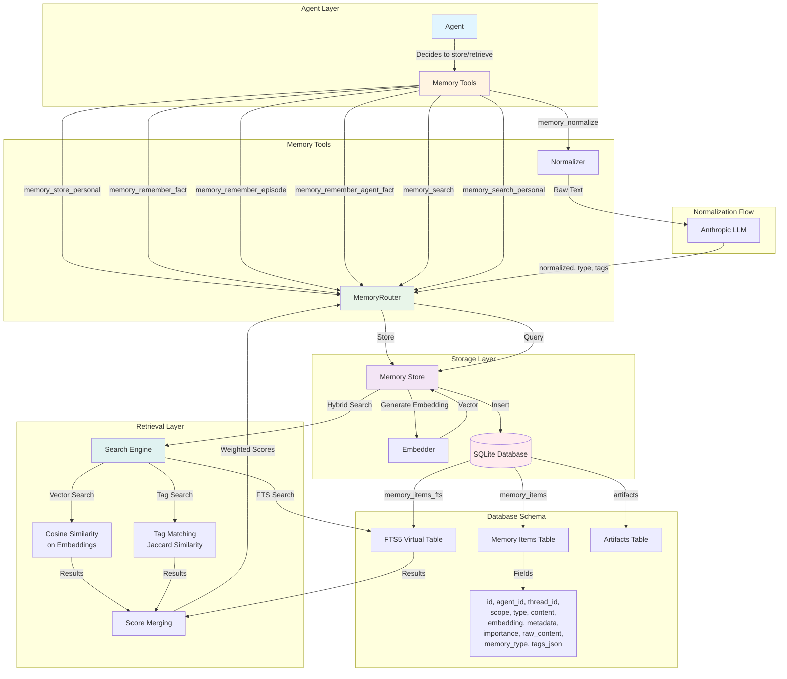
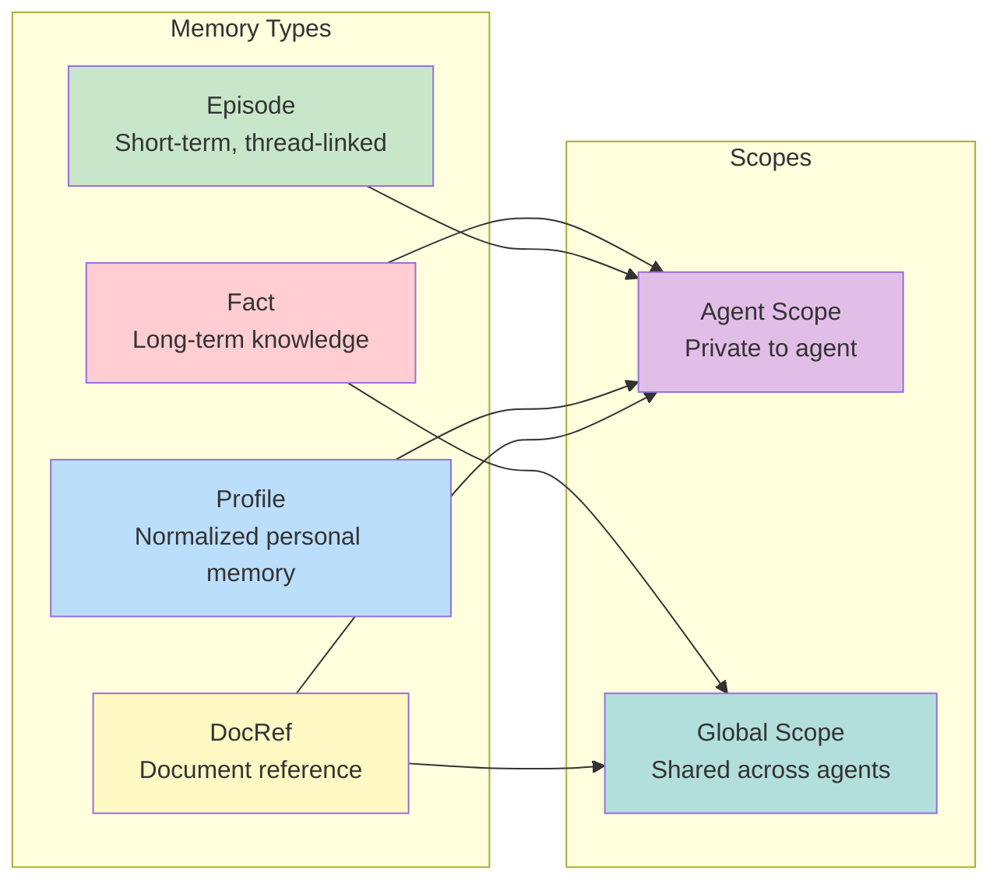
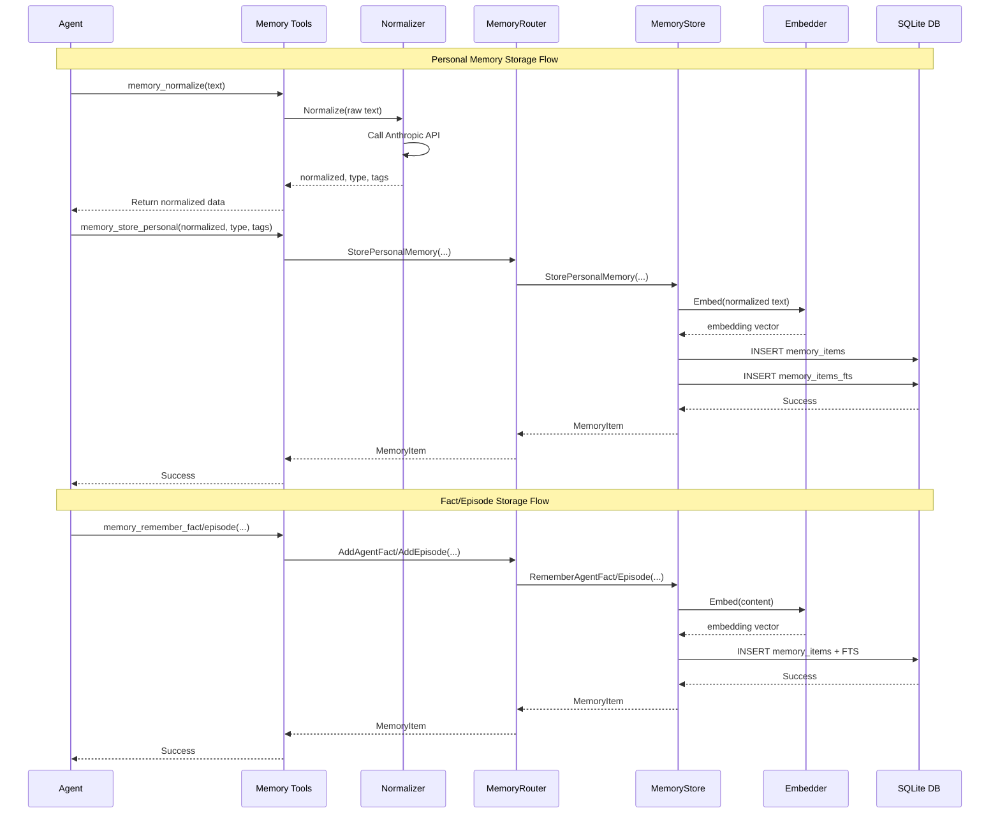
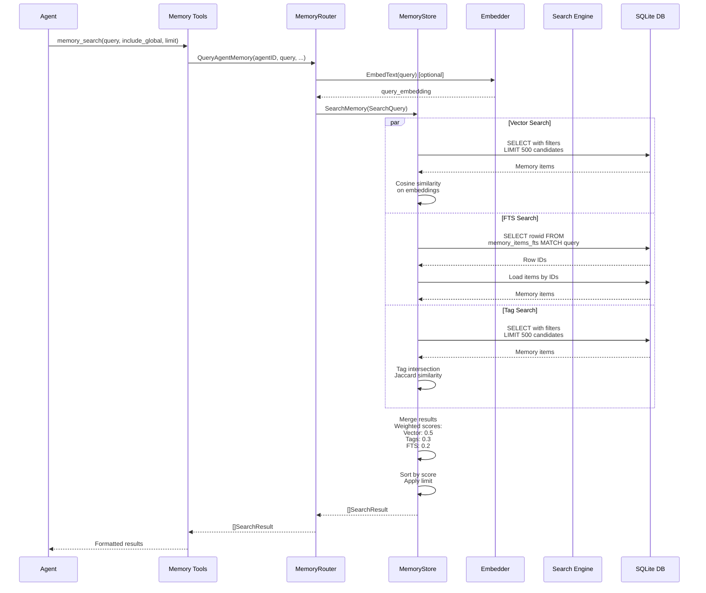
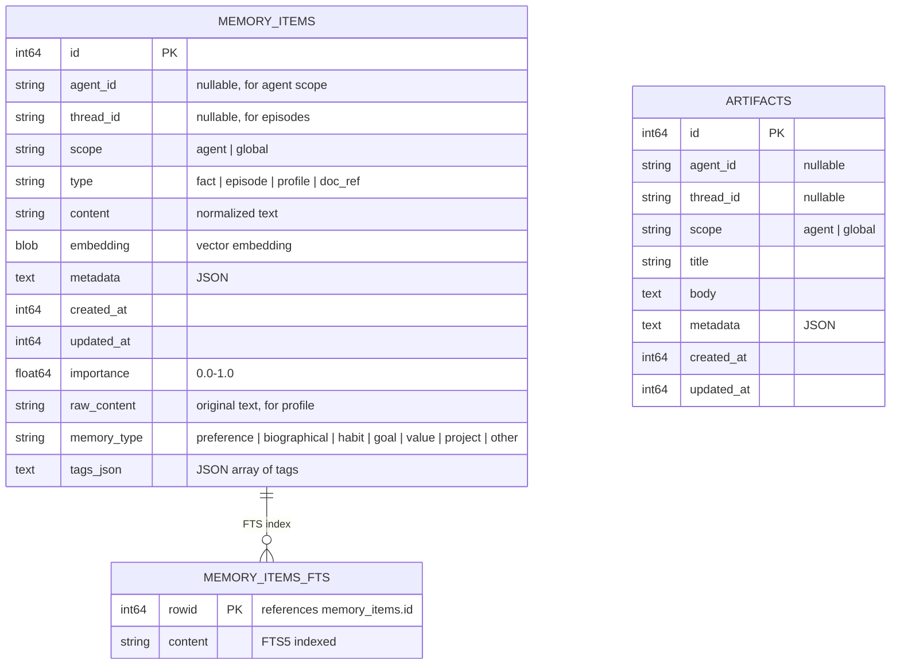
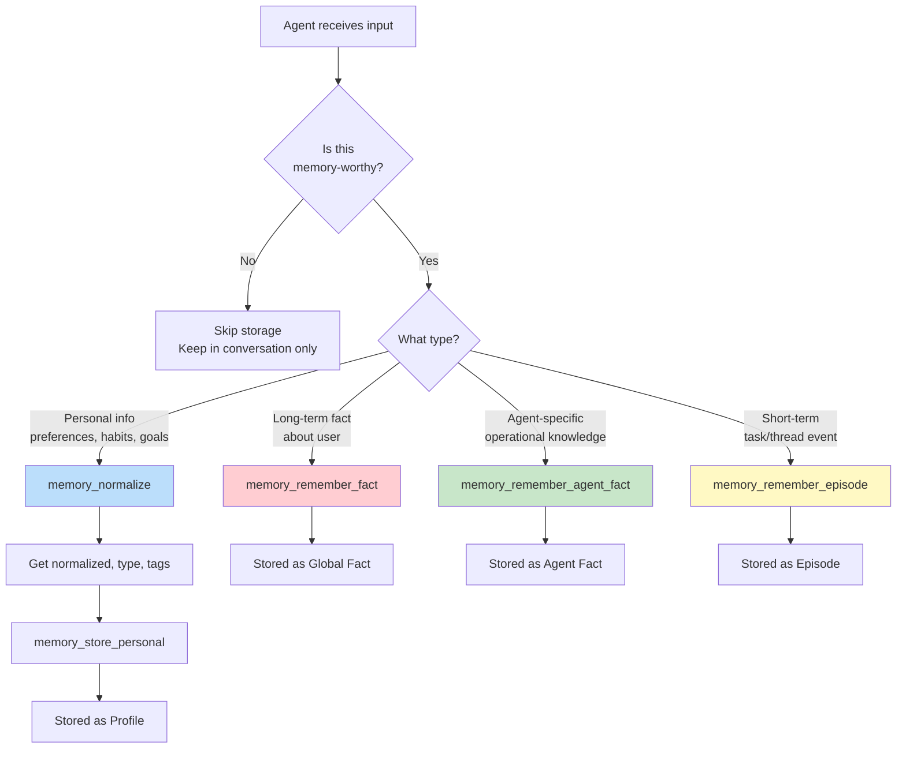
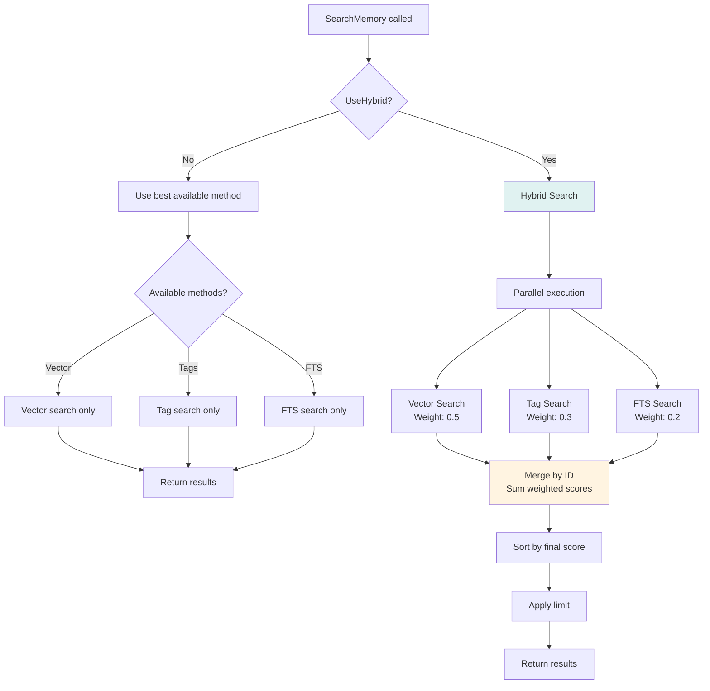
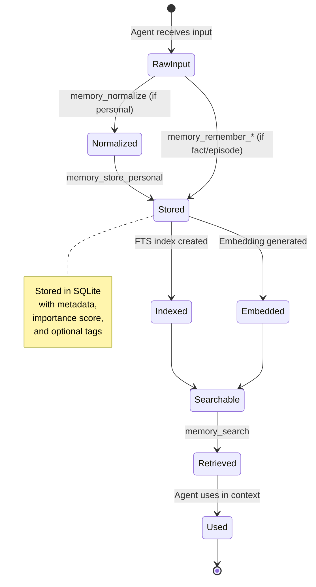

# Memory Architecture Diagram

This document illustrates the memory architecture for staffd agents, showing how memories are stored, retrieved, and managed.

## Architecture Overview

## Memory Types and Scopes

## Storage Flow

## Retrieval Flow

## Memory Storage Structure

## Decision Flow: When to Store

## Hybrid Search Algorithm

## Key Components

### Memory Store (`memory/store.go`)

- **Primary storage interface** for all memory operations
- Handles embedding generation via `Embedder`
- Manages SQLite transactions
- Inserts into both `memory_items` and `memory_items_fts` tables

### Memory Router (`memory/router.go`)

- **High-level API** for agents to interact with memory
- Routes between different memory types and scopes
- Provides query methods: `QueryAgentMemory`, `QueryPersonalMemory`, etc.
- Handles reflection (episode → fact consolidation)

### Normalizer (`memory/normalizer.go`)

- **Converts raw text** into structured personal memories
- Uses Anthropic API to generate:
  - Normalized third-person text
  - Memory type (preference, biographical, habit, goal, value, project, other)
  - Tags (3-8 lowercase tokens)

### Search Engine (`memory/search.go`)

- **Hybrid search** combining:
  - **Vector search**: Cosine similarity on embeddings (weight: 0.5)
  - **Tag search**: Jaccard similarity on tag intersections (weight: 0.3)
  - **FTS search**: Full-text search via SQLite FTS5 (weight: 0.2)
- Filters by scope, type, importance, time range
- Merges and ranks results by weighted scores

### Embedder (`memory/embedder.go`)

- **Pluggable interface** for generating embeddings
- Implementations: Ollama, Anthropic, OpenAI
- Encodes/decodes embeddings as binary blobs

## Storage Details

### When Memories Are Stored

1. **Agent-initiated**: Agents call memory tools when they detect memory-worthy information
2. **Tool-based**: Via `memory_store_personal`, `memory_remember_fact`, etc.
3. **Automatic**: Reflection can consolidate episodes into facts

### What Gets Stored

- **Content**: The actual memory text (normalized for profiles)
- **Embedding**: Vector representation for semantic search
- **Metadata**: Optional JSON metadata
- **Importance**: Score (0.0-1.0) for filtering
- **Tags**: For personal memories, enables tag-based search
- **FTS Index**: Full-text search index in separate virtual table

### How Memories Are Stored

1. Content is embedded (if embedder available)
2. Transaction begins
3. Insert into `memory_items` table
4. Insert into `memory_items_fts` virtual table (for FTS)
5. Transaction commits

## Retrieval Details

### When Retrieval Happens

- **Agent-initiated**: Agents call `memory_search` or `memory_search_personal` tools
- **On-demand**: Not automatic; agents decide when to query
- **Context-aware**: Agents can include global memories or search only agent-scoped

### How Retrieval Works

1. **Query preparation**: Generate embedding for query text (optional)
2. **Parallel search**: Execute vector, FTS, and tag searches in parallel
3. **Filtering**: Apply scope, type, importance, time range filters
4. **Scoring**: Calculate relevance scores for each method
5. **Merging**: Combine results with weighted scores (hybrid mode) or return best method
6. **Ranking**: Sort by final score and apply limit

### Search Methods

- **Vector Search**: Cosine similarity on embeddings, scans up to 500 candidates
- **FTS Search**: SQLite FTS5 full-text search, returns row IDs
- **Tag Search**: Intersection matching with Jaccard similarity, scans up to 500 candidates

## Memory Lifecycle

